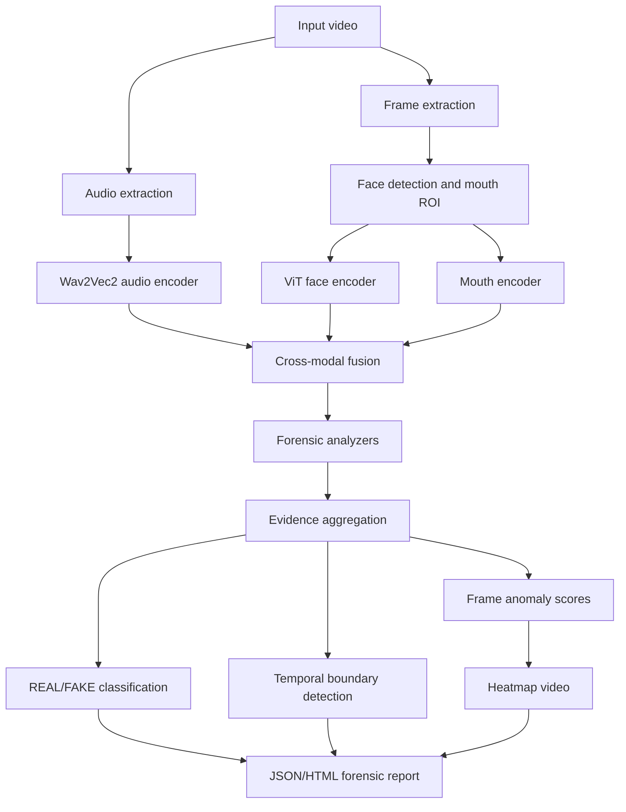

# MDDS Architecture Diagram (Mermaid Source)

```mermaid
flowchart TD
    A[Input video] --> B[Audio extraction]
    A --> C[Frame extraction]
    C --> D[Face detection and mouth ROI]
    B --> E[Wav2Vec2 audio encoder]
    D --> F[ViT face encoder]
    D --> G[Mouth encoder]
    E --> H[Cross-modal fusion]
    F --> H
    G --> H
    H --> I[Forensic analyzers]
    I --> J[Evidence aggregation]
    J --> K[REAL/FAKE classification]
    J --> L[Frame anomaly scores]
    J --> M[Temporal boundary detection]
    L --> N[Heatmap video]
    K --> O[JSON/HTML forensic report]
    M --> O
    N --> O
```
